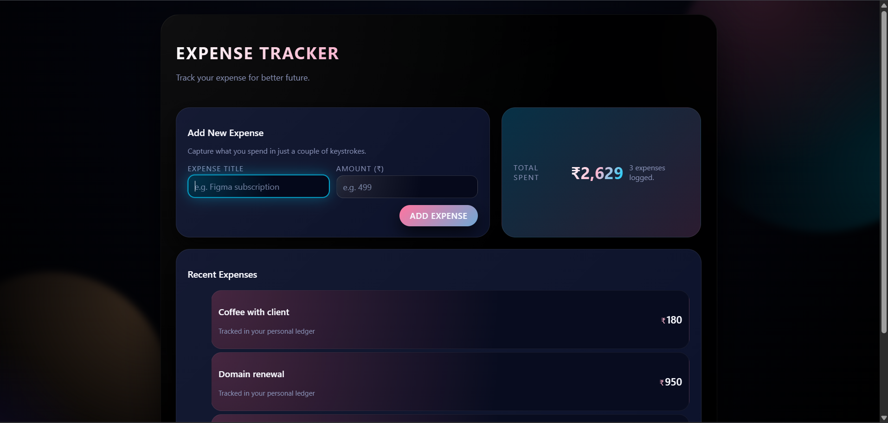

# Syntecxhub Expense Tracker 💰

A modern, responsive **Expense Tracker** application built using **React** and **React Hooks** as part of the **Syntecxhub Web Development Internship Program**.

This project demonstrates practical usage of core React hooks along with clean UI design and performance optimization techniques.

---

## 🚀 Live Preview
> (Optional)

---

## 🛠️ Tech Stack

- React (Vite)
- JavaScript (ES6+)
- HTML5
- CSS3
- React Hooks

---

## 📌 Features

- Add and view expenses in real time
- Responsive and modern UI
- Gradient heading with clean layout
- Optimized rendering for better performance

---

## 🧠 React Hooks Used

| Hook | Purpose |
|-----|--------|
| `useState` | Manage form inputs and expenses list |
| `useEffect` | Fetch initial data from a mock API |
| `useRef` | Auto-focus input fields |
| `useMemo` | Optimize total expense calculation |
| `useCallback` | Prevent unnecessary re-renders |

---

## 📂 Project Structure

Syntecxhub_Expense_Tracker/<br>
├── public/<br>
├── src/<br>
│ ├── components/<br>
│ │ ├── ExpenseForm.jsx<br>
│ │ └── ExpenseList.jsx<br>
│ ├── styles/<br>
│ │ └── App.css<br>
│ ├── App.jsx<br>
│ └── main.jsx<br>
├── package.json<br>
└── README.md<br>

---

## 🧪 How to Run Locally

1. Clone the repository
```
git clone https://github.com/your-username/Syntecxhub_Expense_Tracker.git
```
2. Navigate to the project folder
```
cd Syntecxhub_Expense_Tracker
```
3. Install dependencies
```
npm install
```
4. Start the development server
```
npm run dev
```
5. Open in browser:
```
http://localhost:5173/
```

## 📸 Screenshots


## 🎯 Internship Requirements Covered
✔ React-based project<br>
✔ Heavy usage of Hooks<br>
✔ Clean UI & responsive design<br>
✔ GitHub repository submission<br>
✔ Practical implementation<br>

## 🏢 Internship Program
**Company**: Syntecxhub<br>
**Domain**: Web Development<br>
**Internship Type**: Project-based<br>

## 📬 Contact
🌐 Website: https://www.syntecxhub.com

📧 Email: info@syntecxhub.com

## 📜 License
This project is created for educational and internship purposes.
